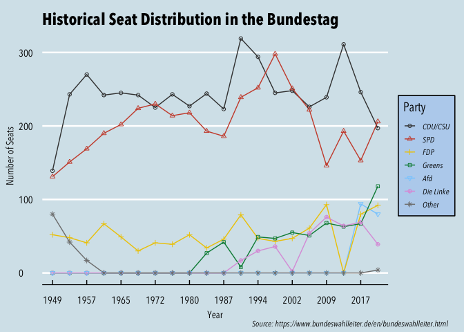
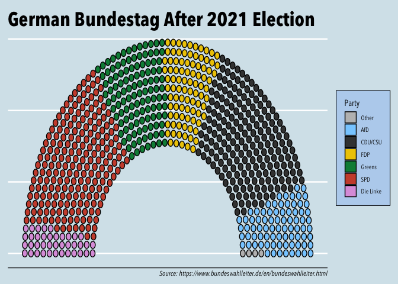
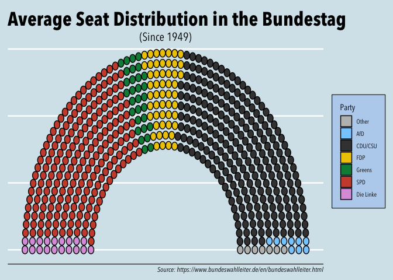

<!-- README.md is generated from README.Rmd. Please edit that file -->

# Visualization of Seat Distribution of Parties in the Bundestag

<!-- badges: start -->
<!-- badges: end -->

How have seat distributions in the Bundestag evolved since its founding
in 1947? Which parties have dominated in which periods? How did the rise
of new parties impact other parties?

## Seat Distribution Since 1947

<!-- -->

## Comparing Current and Historical Compositions

### Current composition

<!-- -->

### Historical composition

<!-- -->

## Source

Data retrieved from Germany’s Federal Returning Officer’s website -
[Bundeswahlleiter](https://www.bundeswahlleiter.de/en/bundeswahlleiter.html).
